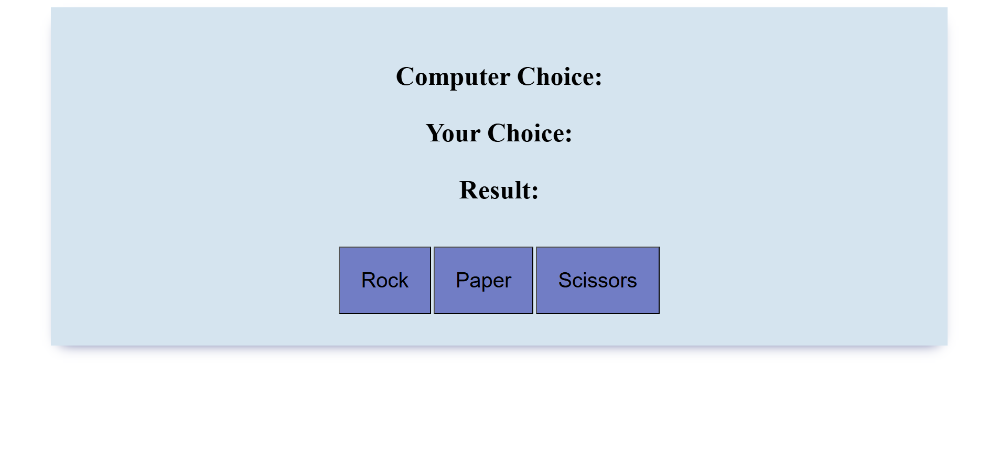

## Rock Paper Scissors Game ✊✋✌️ https://velvetred2020.github.io/rock_paper_scissors_game/

**Rock Paper Scissors Game is a simple and fun browser-based game built with HTML, CSS, and JavaScript. The player selects between "Rock", "Paper", or "Scissors" to play against the computer. After each selection, the result is displayed instantly with one of three possible outcomes: Win, Lose, or Draw.**

## 📸 Screenshots
| **Game View** |
|----------------|
|  |
| **Win Result** |
|  |
| **Lose Result** |
|  |
| **Draw Result** |
|  |

## ✨ Features

- **Interactive Gameplay**:
  - Choose between Rock, Paper, or Scissors.
  - Play against a randomly generated computer choice.
  - Instant result display after each round.

- **Three Possible Outcomes**:
  - Win: Your choice beats the computer.
  - Lose: Computer beats your choice.
  - Draw: Both choices are the same.

- **Minimalist Design**:
  - Clean and responsive layout for quick play.
  - No frameworks—just pure HTML, CSS, and JavaScript.

## 🛠️ Technologies Used

- **HTML**: Structure of the game.
- **CSS**: Styling and layout.
- **JavaScript**: Game logic and result generation.

## 📋 Prerequisites

To run Rock Paper Scissors Game locally, you need:
- A modern web browser (e.g., Chrome, Firefox, Edge).
- Git (optional, for cloning the repository).

## 🚀 Getting Started

You can play the game by clicking the link at the top or here: https://velvetred2020.github.io/rock_paper_scissors_game/

To run it locally:

### 1. Clone the Repository
```bash
git clone https://github.com/velvetred2020/rock_paper_scissors_game.git
cd rock_paper_scissors_game
```

### 2. Open the Game
Just open the `index.html` file in your browser.

### 🖼️ How It Works

**1. Start the Game**  
The game displays three boxes: Rock, Paper, and Scissors.  
Click one to make your choice.

**2. Result Logic**  
The computer randomly selects its move.  
A message appears showing whether you won, lost, or drew.

**3. Replay Anytime**  
Make another selection to play again.

### 📂 Project Structure (simplified)
```
rock_paper_scissors_game/
|-- index.html               # Main HTML file
|-- style.css                # CSS styling
|-- script.js                # JavaScript logic
|-- img/                     # Folder for screenshots
|   |-- rps_view.png
|   |-- rps_win.png
|   |-- rps_lost.png
|   |-- rps_draw.png
|-- LICENSE                  # MIT License
|-- README.md                # This file
```


### 🔧 Usage Notes

- Works on all modern browsers.  
- No installation required—just open the HTML file.  
- Fully responsive for desktop and mobile.

### 🐞 Troubleshooting

- **Game Not Responding**: Make sure JavaScript is enabled.  
- **Images Not Displaying**: Confirm all image paths and filenames are correct.  
- **App Not Loading**: Ensure all files are in the same directory.

### 🌟 Contributing

Contributions are welcome! 🤝

1. Fork the repository.  
2. Create a new branch (`git checkout -b feature/your-feature`).  
3. Commit your changes (`git commit -m "Add your feature"`).  
4. Push to the branch (`git push origin feature/your-feature`).  
5. Open a Pull Request.

**Ideas for contributions:**
- Add score tracking or a leaderboard.  
- Include sound effects for each result.  
- Add animations or visual effects for choices.

### 📜 License

This project is licensed under the MIT License. See the LICENSE file for details.

### 👐 Acknowledgments

- Inspired by the classic hand game.  
- Thanks to the open-source community for creative inspiration.

Made with 💻 and ☕ by Elena (@Velvetred2020). Give it a ⭐ if you enjoyed playing!
